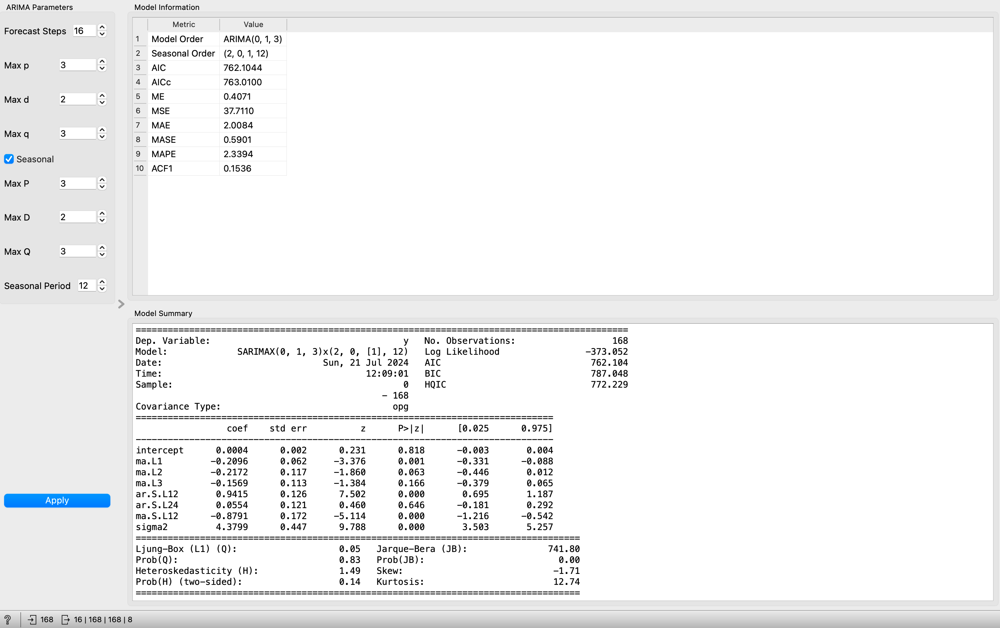
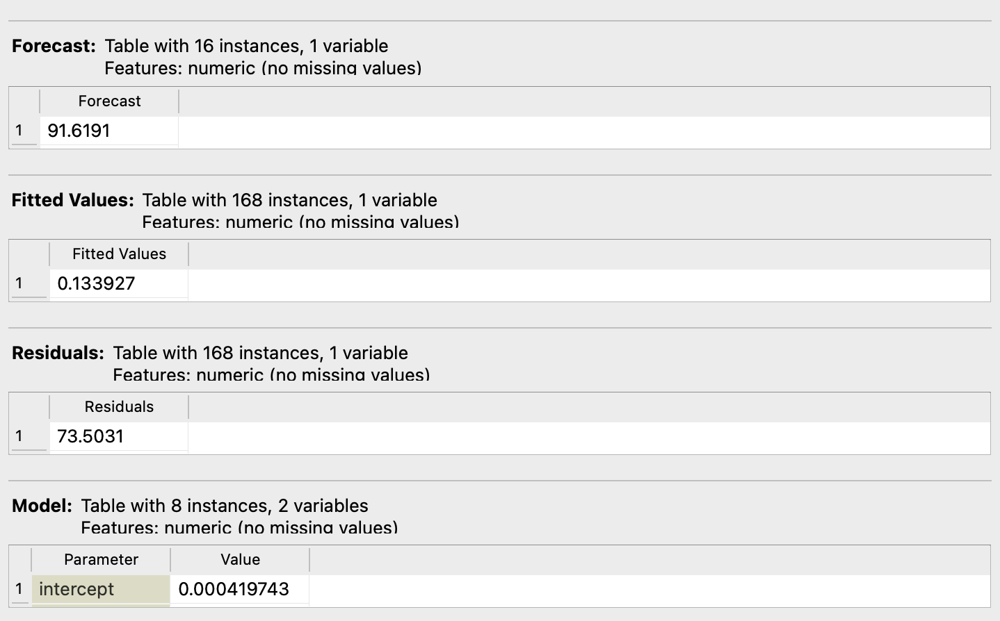

# Auto ARIMA

## Overview
The Auto ARIMA widget automatically fits the best Box-Jenkins model (ARIMA / SARIMA) model to a time series dataset and forecasts future values. It provides several settings to control the complexity of the ARIMA model and handles both non-seasonal and seasonal data. The widget outputs the forecasted values, fitted values, residuals, and a detailed summary of the model and the goodness-of-fit measures.

## Parameters
- **Forecast Steps**: The number of steps to forecast into the future.
- **Max p**: The maximum order of the autoregressive part of the model (AR).
- **Max d**: The maximum degree of differencing.
- **Max q**: The maximum order of the moving average part of the model (MA).
- **Seasonal**: Toggle to enable or disable seasonal components in the model.
- **Max P**: The maximum order of the seasonal autoregressive part of the model (SAR).
- **Max D**: The maximum degree of seasonal differencing.
- **Max Q**: The maximum order of the seasonal moving average part of the model (SMA).
- **Seasonal Period**: The length of the seasonal cycle.

## Inputs
- **Time series data**: The input time series data (Orange.data.Table).

## Outputs
- **Forecast**: A table containing the forecasted values.
- **Fitted Values**: A table containing the fitted values.
- **Residuals**: A table containing the residuals of the fitted model.
- **Model Summary**: A text summary of the fitted model.
- **Model**: A table containing the model parameters and their values.

## GUI Elements
### Model Information Box
- A table displaying key metrics and values of the fitted model.

    Metrics Displayed :-

    - Model Order: The order of the ARIMA model.
    - Seasonal Order: The seasonal order of the SARIMA model.
    - AIC (Akaike Information Criterion)**: A measure of model quality.
    - AICc (Corrected AIC): AIC adjusted for small sample sizes.
    - ME (Mean Error): Average of the residuals.
    - MSE (Mean Squared Error): Average of the squared differences between observed and fitted values.
    - MAE (Mean Absolute Error): Average of the absolute differences between observed and fitted values.
    - MASE (Mean Absolute Scaled Error): Scaled version of MAE for comparability across different datasets.
    - MAPE (Mean Absolute Percentage Error): Average of the absolute percentage errors.
    - ACF1 (Autocorrelation at lag 1): The autocorrelation of residuals at lag 1.

### Model Summary Box
- A text area displaying a detailed summary of the fitted model.

