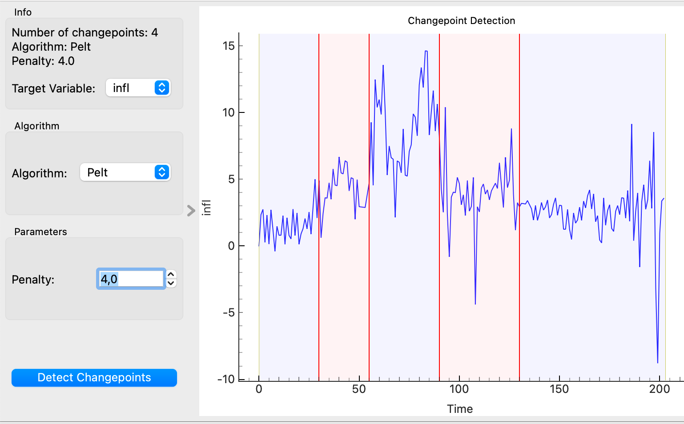

# Changepoint Detection Widget

## Overview
The **Changepoint Detection** widget identifies and visualizes changepoints in time series data using the `ruptures` library. It supports multiple changepoint detection algorithms and allows for the visualization of detected changepoints.

## Parameters
- **target_variable**: The time series variable in the data to be analyzed for changepoints.
- **algorithm**: The algorithm used for changepoint detection:
     - **Pelt**: Penalized likelihood method that efficiently detects changepoints by minimizing a cost function with a penalty.
     - **Binseg**: Binary segmentation method that recursively segments the time series into two parts.
     - **BottomUp**: Bottom-up segmentation that starts with all possible changepoints and merges segments based on the penalty.
     - **Window**: Window-based method that identifies changepoints within a sliding window.
- **penalty**: The penalty value used by the algorithm to determine the number of changepoints.

## Inputs
- **time_series**: A table of time series data (Orange.data.Table). This table should include the time series data for changepoint analysis.

## Outputs
- **changepoints**: A table containing detected changepoints (Orange.data.Table). Includes changepoint positions and times.

