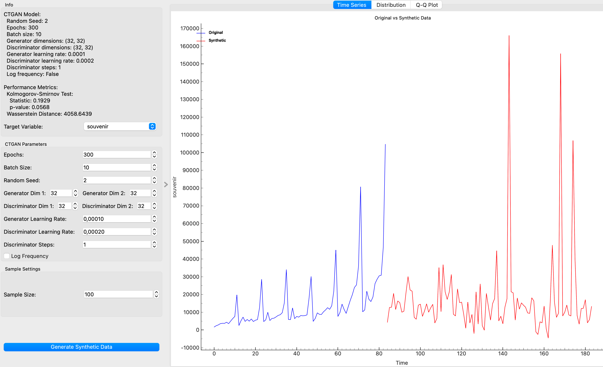
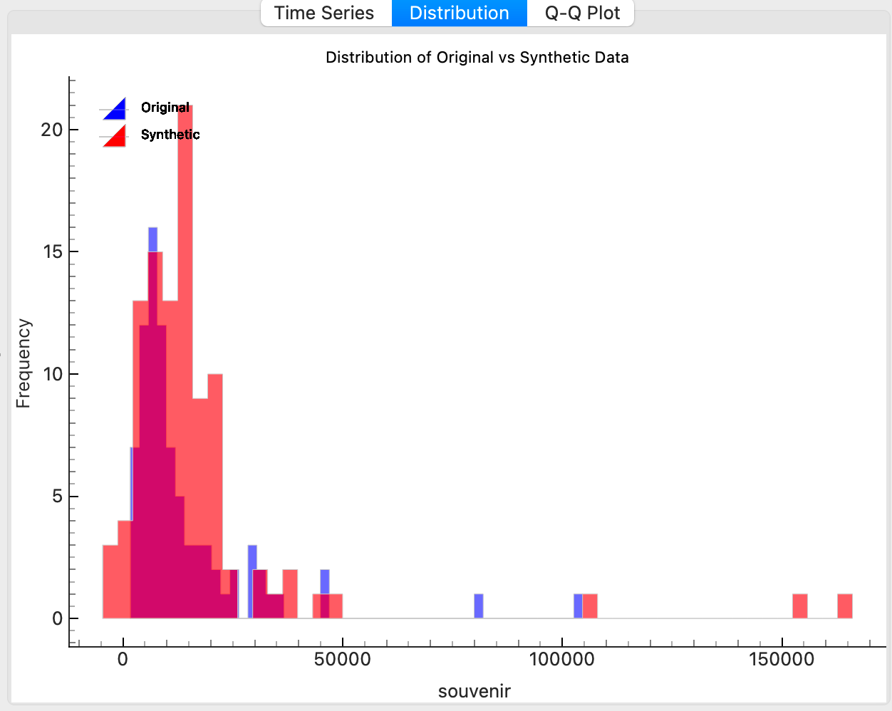
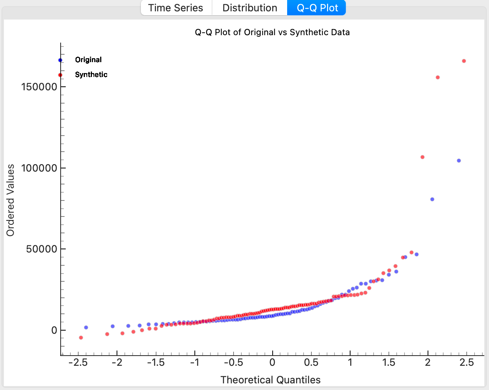

# CTGAN Data Augmentation Widget

## Overview
The **CTGAN Data Augmentation** widget uses Conditional Generative Adversarial Networks (CTGAN) to augment time series data. The widget allows users to configure CTGAN parameters, generate synthetic data, and visualize comparisons between original and synthetic data through time series plots, distribution plots, and Q-Q plots.

*time series plots*

*distribution plots*

*Q-Q plots*

## Parameters
- **target_variable**: The target variable in the time series data to be augmented.
- **epochs**: Number of training epochs for the CTGAN model.
- **batch_size**: Size of the training batch.
- **generator_dim_1**: Number of units in the first layer of the generator.
- **generator_dim_2**: Number of units in the second layer of the generator.
- **discriminator_dim_1**: Number of units in the first layer of the discriminator.
- **discriminator_dim_2**: Number of units in the second layer of the discriminator.
- **generator_lr**: Learning rate for the generator.
- **discriminator_lr**: Learning rate for the discriminator.
- **discriminator_steps**: Number of steps to train the discriminator for each generator step.
- **log_frequency**: Whether to log training frequency.
- **sample_size**: Number of synthetic samples to generate.
- **random_seed**: Seed for random number generation to ensure reproducibility.

## Inputs
- **data**: A table of time series data (Orange.data.Table). This table should contain the time series data to be used for training the CTGAN model.

## Outputs
- **augmented_data**: A table with the original and synthetic time series data (Orange.data.Table). Includes the augmented dataset with original data and generated synthetic samples.
