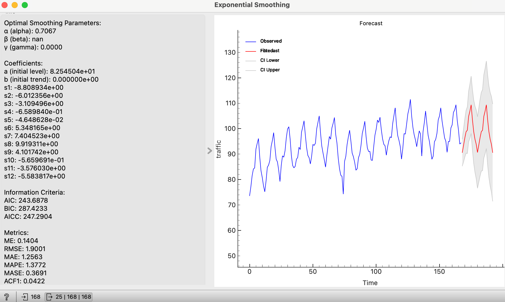
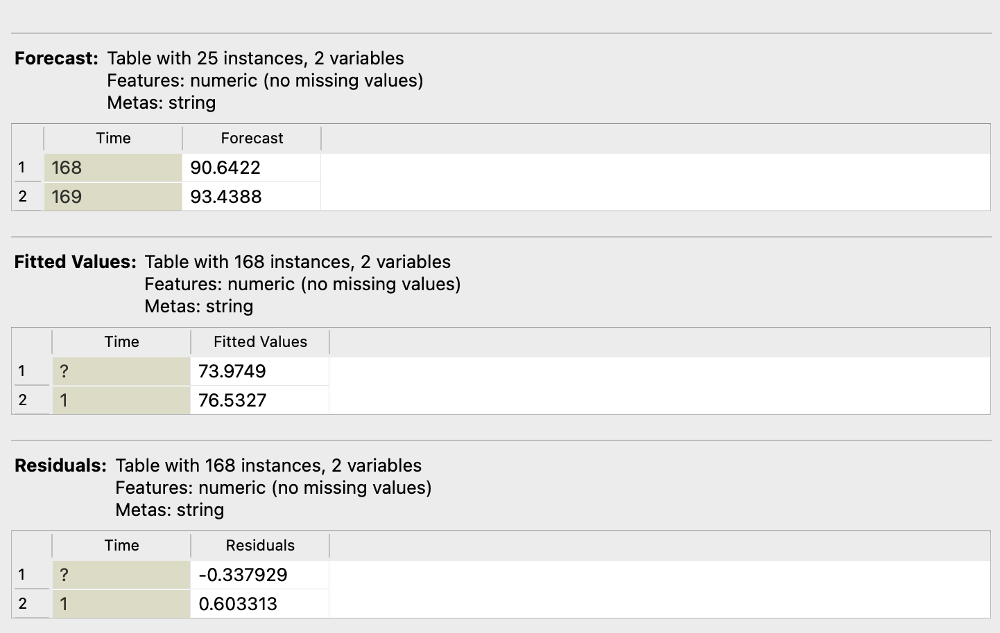

# Exponential Smoothing Widget Documentation

## Overview

The **Exponential Smoothing** widget fits Exponential Smoothing models to time series data and provides visualizations for the results. It supports Simple Exponential Smoothing, Holt's Linear Trend Model, and Holt-Winters Seasonal Models (Additive and Multiplicative). The widget allows users to input time series data, specify the target variable, choose the type of Exponential Smoothing model, and visualize the fitted values and forecasted values along with confidence intervals.

## Inputs and Outputs

### Inputs

- **Time Series**: The time series data to be modeled. This should be provided as an Orange `Table`.

### Outputs

- **Forecast**: The forecasted values generated by the fitted model.
- **Fitted Values**: The values fitted by the model to the input time series.
- **Residuals**: The residuals from the fitted model.

## Settings

- **Model Type**: Choose between Simple Exponential Smoothing, Holt's Linear Trend Model, Holt-Winters Additive Model, or Holt-Winters Multiplicative Model.
- **Seasonality**: Set the seasonal period for Holt-Winters models.
- **Forecast Steps**: Specify the number of steps to forecast into the future.
- **Target Variable**: Select the target variable from the input data.
- **Plot Type**: Choose between visualizing the forecast or the fitted values.

## Model Parameters
- **a (initial level)**: The initial level coefficient.
- **b (initial trend)**: The initial trend coefficient (for Holt and Holt-Winters models).
- **Seasonal Components (s1, s2, ...)**: Seasonal coefficients for Holt-Winters models.

### Information Criteria
- **AIC (Akaike Information Criterion)**
- **BIC (Bayesian Information Criterion)**
- **AICC (Corrected Akaike Information Criterion)**

### Model Metrics
- **ME (Mean Error)**
- **RMSE (Root Mean Squared Error)**
- **MAE (Mean Absolute Error)**
- **MAPE (Mean Absolute Percentage Error)**
- **MASE (Mean Absolute Scaled Error)**
- **ACF1 (Autocorrelation of residuals at lag 1)**

