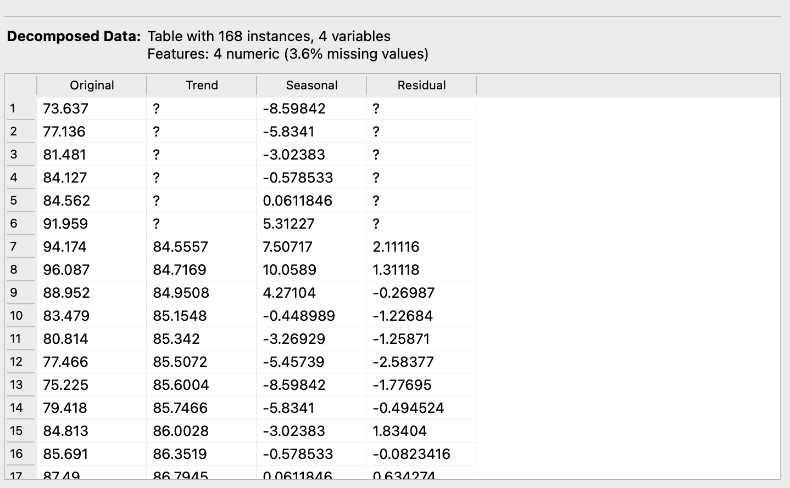

# Seasonal Decomposition Widget

## Overview

The **Seasonal Decomposition** widget performs seasonal decomposition on time series data. It allows users to input a time series dataset, select a target variable, specify decomposition parameters, and visualize the decomposed components (trend, seasonal, and residual). The widget supports both additive and multiplicative models.

## Inputs and Outputs

### Inputs

- **Time Series**: The time series data to be decomposed. This should be provided as an Orange `Table`.

### Outputs

- **Decomposed Data**: The decomposed components (original, trend, seasonal, and residual) as an Orange `Table`.

## Settings

- **Seasonality**: The period of seasonality in the time series.
- **Target Variable**: The variable in the dataset to be decomposed.
- **Model**: The type of decomposition model (`Additive` or `Multiplicative`).
- **Max Lags for ACF**: The maximum number of lags to be used in the autocorrelation function plot of the residuals.

## Plot Area

The main area contains four plot widgets to display the decomposed components and the autocorrelation function (ACF) of the residuals:

- **Original Plot**: Displays the original time series data.
- **Trend Plot**: Displays the trend component.
- **Seasonal Plot**: Displays the seasonal component.
- **Residual ACF Plot**: Displays the ACF of the residuals.

